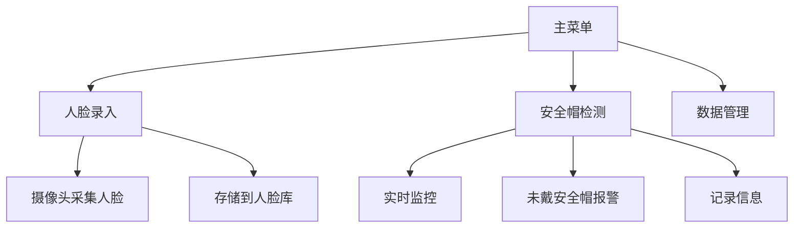
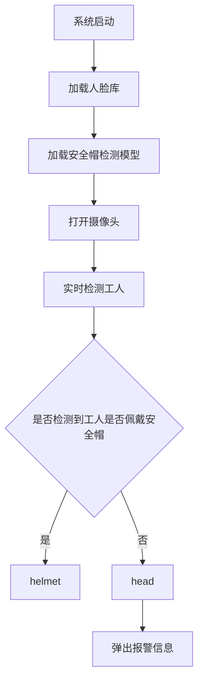

# -RK3588-HOG-YOLOv5-
一种员工监控系统，该系统融合了HOG和YOLOv5深度学习模型，用于实时检测员工是否佩戴安全帽。
# Worker Monitoring System Documentation

## 系统概述

`worker_monitoring.py` 是一个综合性的工人监控系统，结合了人脸识别和目标检测技术，用于实时监控工人是否佩戴安全帽。系统集成了 YOLOv5 进行目标检测，HOG 用于行人检测，以及人脸识别技术进行身份验证。系统还提供了图形用户界面 (GUI) 和数据库管理功能。

---

## 系统功能

1. **人脸录入**：通过摄像头录入工人面部信息并存储到 SQLite 数据库。
2. **实时安全帽检测**：结合 HOG 和 YOLOv5 技术，实时监控工人是否佩戴安全帽。
3. **数据库管理**：使用 SQLite 数据库存储人脸数据和离岗记录。
4. **数据导出**：支持将数据导出为 JSON 和 CSV 格式。
5. **图形用户界面 (GUI)**：提供用户友好的界面，便于操作。

---

## 核心技术介绍

### 1. OpenCV

#### 技术简介

OpenCV 是一个开源的计算机视觉库，支持图像处理、视频分析和机器学习等功能。在本系统中，OpenCV 用于：

- 打开摄像头并捕获实时画面。
- 显示视频流。
- 处理图像数据。

#### 依赖库

- **`opencv-python`**：用于图像和视频处理。

#### 安装方法

依赖库已包含在 `requirements.txt` 文件中，可通过以下命令安装：

```bash
pip install -r requirements.txt
```

#### 核心代码与调用流程

```python
cap = cv2.VideoCapture(0)  # 打开摄像头
if not cap.isOpened():
    print("无法打开摄像头")
    return

while True:
    ret, frame = cap.read()  # 读取摄像头画面
    if not ret:
        print("无法读取摄像头画面")
        break

    cv2.imshow("实时画面", frame)  # 显示画面

    if cv2.waitKey(1) & 0xFF == ord('q'):
        break

cap.release()  # 释放摄像头资源
cv2.destroyAllWindows()  # 关闭所有窗口
```

- **`cv2.VideoCapture(0)`**：打开默认摄像头。
- **`cap.read()`**：读取摄像头的当前帧。
- **`cv2.imshow()`**：显示图像或视频帧。
- **`cv2.waitKey(1)`**：等待键盘输入，`ord('q')` 表示按下 `q` 键退出。
- **`cap.release()`** 和 **`cv2.destroyAllWindows()`**：释放资源并关闭窗口。

---

### 2. face_recognition

#### 技术简介

`face_recognition` 是一个基于深度学习的人脸识别库，支持人脸检测、特征提取和比对。在本系统中，`face_recognition` 用于：

- 检测画面中的人脸。
- 提取人脸特征向量。
- 比对人脸特征以验证身份。

#### 依赖库

- **`face_recognition`**：用于人脸检测和特征提取。
- **`dlib`**：`face_recognition` 的底层依赖。

#### 安装方法

依赖库已包含在 `requirements.txt` 文件中，可通过以下命令安装：

```bash
pip install -r requirements.txt
```

#### 核心代码与调用流程

```python
face_locations = face_recognition.face_locations(frame)  # 检测人脸位置
if face_locations:
    face_encodings = face_recognition.face_encodings(frame, face_locations)  # 提取人脸特征
    for face_encoding in face_encodings:
        matches = face_recognition.compare_faces(known_encodings, face_encoding)  # 比对特征
        if True in matches:
            print("身份验证成功")
        else:
            print("身份验证失败")
```

- **`face_recognition.face_locations(frame)`**：检测图像中的人脸位置，返回人脸的边界框坐标。
- **`face_recognition.face_encodings(frame, face_locations)`**：提取人脸特征向量，用于身份验证。
- **`face_recognition.compare_faces(known_encodings, face_encoding)`**：将提取的特征与已知特征进行比对，返回布尔值列表。

---

### 3. YOLOv5

#### 技术简介

YOLOv5 是一种实时目标检测算法，能够快速准确地检测图像中的目标。在本系统中，YOLOv5 用于：

- 检测画面中的人员。
- 辅助判断工人是否在岗。

#### 依赖库

- **`torch`**：用于加载和运行 YOLOv5 模型。
- **`torchvision`**：与 `torch` 配合使用。

#### 安装方法

依赖库已包含在 `requirements.txt` 文件中，可通过以下命令安装：

```bash
pip install -r requirements.txt
```

#### 核心代码与调用流程

```python
model = torch.hub.load('ultralytics/yolov5', 'yolov5s')  # 加载YOLOv5模型
results = model(frame)  # 对当前帧进行推理
for detection in results.xyxy[0]:
    x1, y1, x2, y2, conf, cls = detection  # 提取检测结果
    if results.names[int(cls)] == 'person':
        print("检测到人员")
```

- **`torch.hub.load()`**：加载预训练的 YOLOv5 模型。
- **`model(frame)`**：对输入图像进行推理，返回检测结果。
- **`results.xyxy[0]`**：包含检测框的坐标、置信度和类别。
- **`results.names`**：类别名称映射。

---

## 系统功能图



---

## 技术路线图



---

## 核心功能及技术实现

### 1. 人脸录入及人脸库

#### 功能描述

- 通过摄像头采集工人面部信息。
- 提取人脸特征并存储到 SQLite 数据库。
- 人脸库用于后续的身份验证。

#### 核心代码

```python
cap = cv2.VideoCapture(0)
print("请将人脸对准摄像头，按 'q' 键完成录入")

while True:
    ret, frame = cap.read()
    if not ret:
        print("无法读取摄像头画面")
        break

    cv2.imshow("人脸录入", frame)

    if cv2.waitKey(1) & 0xFF == ord('q'):
        face_locations = face_recognition.face_locations(frame)
        if face_locations:
            face_encodings = face_recognition.face_encodings(frame, face_locations)
            if face_encodings:
                face_data = {
                    "employee_id": employee_id,
                    "name": name,
                    "position": position,
                    "face_id": face_id,
                    "encoding": face_encodings[0].tolist()
                }
                os.makedirs("face_library", exist_ok=True)
                with open(f"face_library/{face_id}.json", "w") as f:
                    json.dump(face_data, f)
                print(f"人脸录入成功：{name} ({employee_id})，人脸号: {face_id}")
            else:
                print("未能提取到人脸特征，请重试")
        else:
            print("未检测到人脸，请重试")
        break

cap.release()
cv2.destroyAllWindows()
```

---

### 2. 安全帽检测功能

#### 功能描述

- 实时监控工人是否佩戴安全帽。
- 结合 head_helmet检测模型 和 HOG 技术进行目标检测。
- 未佩戴安全帽时触发报警并记录。

#### 核心代码

```python
cap = cv2.VideoCapture(0)
if not cap.isOpened():
    print("无法打开摄像头")
    return

last_seen_time = datetime.now()
absence_threshold = timedelta(minutes=1)

while True:
    ret, frame = cap.read()
    if not ret:
        print("无法读取摄像头画面")
        break

    results = model(frame)
    detections = results.xyxy[0].cpu().numpy()
    labels = results.names

    worker_detected = any(labels[int(detection[5])] == 'person' for detection in detections)

    if worker_detected:
        last_seen_time = datetime.now()
        print(f"[{datetime.now()}] 检测到工人在岗")
    else:
        elapsed_time = datetime.now() - last_seen_time
        if elapsed_time > absence_threshold:
            minutes = int(elapsed_time.total_seconds() // 60)
            absence_date = last_seen_time.strftime("%Y-%m-%d")
            absence_duration = str(elapsed_time).split('.')[0]

            conn = get_db_connection()
            if conn:
                insert_absence_record(conn, "unknown", "unknown", absence_duration, absence_date)
                conn.close()

            message = f"工人离岗超过{minutes}分钟，请检查！"
            print(message)
            Thread(target=alert_popup_dynamic, args=(message,)).start()
```

#### 关键技术

- **YOLOv5**：用于目标检测，识别画面中的人员。
- **HOG**：用于行人检测，作为辅助检测手段。
- **SQLite**：记录离岗信息。
- **Tkinter**：弹窗报警。

---

### 3. 页面实现

#### 功能描述

- 提供主菜单，用户可选择人脸录入或离岗检测功能。
- 实时显示摄像头画面。

#### 核心代码

```python
def main_menu():
    root = Tk()
    root.title("Home")
    root.geometry("400x400")

    font = set_chinese_font()

    Label(root, text="Worker Absence Detection System", font=tkFont.Font(family="Arial", size=18)).pack(pady=20)

    Button(root, text="Face Enrollment", command=lambda: [root.destroy(), create_face_enrollment_page()], font=font).pack(pady=20)
    Button(root, text="Absence Detection", command=lambda: [root.destroy(), create_monitoring_page()], font=font).pack(pady=20)
    Button(root, text="Exit", command=root.quit, font=font).pack(pady=20)

    root.mainloop()
```

#### 关键技术

- **Tkinter**：用于创建图形用户界面。
- **按钮事件**：实现页面跳转。

---

## 数据存储说明

### 人脸数据存储

- 人脸数据被存储在 SQLite 数据库的 `face_records` 表中。
- 每条记录包含以下字段：
  - `employee_id`：工人编号，唯一标识。
  - `name`：工人姓名。
  - `position`：工人职位。
  - `face_id`：人脸编号，唯一标识。
  - `face_encoding`：人脸特征向量，存储为 JSON 格式的字符串。
  - `created_at`：记录创建时间。

### 违规记录存储

- 违规记录被存储在 SQLite 数据库的 `absence_records` 表中。
- 每条记录包含以下字段：
  - `employee_id`：工人编号。
  - `name`：工人姓名。
  - `violation`：离岗时长。
  - `absence_date`：离岗日期。
  - `Image Path：记录创建时间。

---

## 数据迁移

### JSON 文件迁移到数据库

在早期版本中，人脸数据存储在本地的 JSON 文件中。为了提高数据管理的效率和一致性，系统提供了一个自动迁移功能，将现有的 JSON 文件数据迁移到 SQLite 数据库中。

#### 迁移过程

1. **检查 JSON 文件目录**：系统会检查 `face_library` 目录是否存在。
2. **读取 JSON 文件**：逐个读取目录中的 JSON 文件。
3. **解析数据**：提取工人编号、姓名、职位和人脸特征向量。
4. **存储到数据库**：将解析后的数据插入到 `face_records` 表中。
5. **标记迁移完成**：在迁移完成后，系统会创建一个 `.migration_completed` 文件，避免重复迁移。

#### 核心代码

```python
def migrate_json_to_db():
    """将现有JSON文件数据迁移到数据库"""
    try:
        # 确保人脸库目录存在
        if not os.path.exists("face_library"):
            print("Face library directory doesn't exist, no migration needed")
            return

        # 迁移计数
        migrated_count = 0
        failed_count = 0

        for file in os.listdir("face_library"):
            if file.endswith(".json"):
                try:
                    with open(os.path.join("face_library", file), "r") as f:
                        face_data = json.load(f)

                    # 提取数据
                    employee_id = face_data.get("employee_id")
                    name = face_data.get("name")
                    position = face_data.get("position")
                    encoding = np.array(face_data.get("encoding"))

                    # 保存到数据库
                    if save_face_to_db(employee_id, name, position, encoding):
                        migrated_count += 1
                    else:
                        failed_count += 1

                except Exception as e:
                    print(f"Failed to migrate file {file}: {e}")
                    failed_count += 1

        print(f"Migration completed: {migrated_count} successful, {failed_count} failed")
    except Exception as e:
        print(f"Error during migration process: {e}")
```

---

## 数据导出

### 支持的导出格式

1. **JSON 格式**：
   - 人脸数据可以导出为 JSON 文件，便于备份或与其他系统集成。
   - 导出时会将人脸特征向量从 NumPy 数组转换为列表。

2. **CSV 格式**：
   - 离岗记录可以导出为 CSV 文件，便于数据分析和报告生成。

#### 核心代码

```python
def export_to_json(table_name):
    """导出表数据到JSON文件"""
    try:
        filename = f"{table_name}_{datetime.now().strftime('%Y%m%d_%H%M%S')}.json"

        if table_name == "face_records":
            # 导出人脸数据
            face_data_list = get_all_faces_from_db()

            # 将numpy数组转换为列表以便序列化
            for face_data in face_data_list:
                face_data["encoding"] = face_data["encoding"].tolist()

            with open(filename, "w") as f:
                json.dump(face_data_list, f, indent=2)
        else:
            # 导出其他表
            with sqlite3.connect('worker_monitoring.db') as conn:
                df = pd.read_sql_query(f"SELECT * FROM {table_name}", conn)
                df.to_json(filename, orient="records", indent=2)

        messagebox.showinfo("Success", f"Data exported to {filename}")
    except Exception as e:
        messagebox.showerror("Error", f"Error: {e}")


def export_to_csv(table_name):
    """导出表数据到CSV文件"""
    try:
        with sqlite3.connect('worker_monitoring.db') as conn:
            df = pd.read_sql_query(f"SELECT * FROM {table_name}", conn)

        filename = f"{table_name}_{datetime.now().strftime('%Y%m%d_%H%M%S')}.csv"
        df.to_csv(filename, index=False)
        messagebox.showinfo("Success", f"Data exported to {filename}")
    except Exception as e:
        messagebox.showerror("Error", f"Error: {e}")
```

---

## 依赖安装

### 统一依赖文件

所有依赖库已统一列在 `requirements.txt` 文件中，内容如下：

```
# 核心框架与数值计算
torch>=1.8.0  # PyTorch深度学习框架
torchvision>=0.9.0  # PyTorch视觉工具库
numpy>=1.19.5  # 数值计算库
opencv-python>=4.5.3  # OpenCV图像处理库
 Pillow>=8.3.1  # Python图像处理库

# 人脸识别与图形界面
face-recognition>=1.3.0  # 人脸识别库
tkinter>=8.6  # GUI工具包（Python标准库，通常无需单独安装）
tkinter-font>=0.1  # Tkinter字体支持

# 数据处理与存储
pandas>=1.3.3  # 数据分析库
sqlite3>=2.6.0  # SQLite数据库支持（Python标准库）
json5>=0.9.6  # JSON数据处理

# 网络与模型下载
requests>=2.26.0  # HTTP请求库
tqdm>=4.62.3  # 进度条显示库

# 中文处理
pypinyin>=0.44.0  # 中文转拼音工具

# RKNN相关（用于NPU推理）
rknnlite>=1.6.0  # RKNN Lite推理库
rknn-toolkit2>=1.4.0  # RKNN工具包（可选，用于模型转换）

# 其他工具
threading>=3.3.0  # 多线程支持（Python标准库）
queue>=1.0  # 队列支持（Python标准库）
signal>=1.0  # 信号处理（Python标准库）
sys>=3.0  # 系统功能（Python标准库）
os-sys>=2.1.4  # 操作系统接口xxxxxxxxxx torchtorchvisionopencv-pythonface_recognitiondlibnumpytqdmrequestspypinyin# 核心框架与数值计算torch>=1.8.0  # PyTorch深度学习框架torchvision>=0.9.0  # PyTorch视觉工具库numpy>=1.19.5  # 数值计算库opencv-python>=4.5.3  # OpenCV图像处理库 Pillow>=8.3.1  # Python图像处理库# 人脸识别与图形界面face-recognition>=1.3.0  # 人脸识别库tkinter>=8.6  # GUI工具包（Python标准库，通常无需单独安装）tkinter-font>=0.1  # Tkinter字体支持# 数据处理与存储pandas>=1.3.3  # 数据分析库sqlite3>=2.6.0  # SQLite数据库支持（Python标准库）json5>=0.9.6  # JSON数据处理# 网络与模型下载requests>=2.26.0  # HTTP请求库tqdm>=4.62.3  # 进度条显示库# 中文处理pypinyin>=0.44.0  # 中文转拼音工具# RKNN相关（用于NPU推理）rknnlite>=1.6.0  # RKNN Lite推理库rknn-toolkit2>=1.4.0  # RKNN工具包（可选，用于模型转换）# 其他工具threading>=3.3.0  # 多线程支持（Python标准库）queue>=1.0  # 队列支持（Python标准库）signal>=1.0  # 信号处理（Python标准库）sys>=3.0  # 系统功能（Python标准库）os-sys>=2.1.4  # 操作系统接口pillow
```

### 安装方法

运行以下命令安装所有依赖：

```bash
pip install -r requirements.txt
```

---

## Notes

- Ensure the camera is connected and functional.
- If the YOLOv5 model is not present, it will be downloaded automatically.
- The system supports both English and Chinese names.

